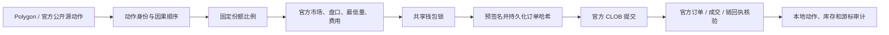

# Polymarket 项目完整交接手册

> 用途：把整个 Polymarket 项目迁移给另一个 Agent，而不依赖当前对话上下文。  
> 正文生成时间：2026-08-17 03:09（Asia/Shanghai）。第 1 节以后多数是当时快照，**不能当当前版本或当前拓扑**。  
> 2026-08-17 18:20 接管勘误见第 0 节；18:40 用户答完原 0.3 未决项并授权提交 3.21 源码。当时服务器权威版本是 **3.21**，仍须每次先跑版本解析器。  
> 安全说明：本文不包含私钥、CLOB API secret/passphrase、Bark key 或可重放签名。

---

## 0. 接管勘误、现网即时读数、仍不清楚的点

本节是 2026-08-17 18:20–18:25（Asia/Shanghai）对照服务器即时读数写的。正文里写 3.18 / 3.19、两个 live profile 都在跑、下一步候选是 3.19 的段落，全部过期。

### 0.1 已经核对清楚、接手者不得再猜

| 对象 | 即时读数 | 来源 | 来源分类 |
|---|---|---|---|
| 权威修复版本 | `3.21`，`VERIFIED_FIXED`，解析器 11 / 11 | `verify_repair_version_authority.py` | 实证值 |
| 当前 release | `/opt/polymarket-live/releases/20260817T052230Z-high-price-vwap-truncation-v3.21` | `readlink -f /opt/polymarket-live/current` 与固定索引 | 实证值 |
| 3.21 cutover | `2026-08-17T05:30:29.404905Z` | `/opt/polymarket-live/CURRENT_REPAIR_VERSION.json` | 实证值 |
| 3.21 修的是什么 | BUY 0.90 同价跟随吸收链上 `1e-6` VWAP 截断；真实更差 Ask 仍拦截；SELL 未改 | 3.21 `COMMITTED.json` `scope` | 实证值 |
| 版本链 | 3.18 `active-cancel-still-open` → 3.19 `retired-cd90-recovered-internal` → 3.20 `bark-human-briefing` → 3.21 `high-price-vwap-truncation` | `/opt/polymarket-live/releases/` 目录与各 `COMMITTED.json` | 实证值 |
| 下一修复候选 | 若再有一次 `VERIFIED_FIXED`，才是 **3.22** | 版本公式：当前 minor + 1 | 公式推导值 |
| Zockdo | primary + hot-standby 均为 `active` + `enabled`；进程 2；PID 当时为 3549847 / 3549848 | systemd + `pgrep` | 实证值 |
| wallet9506 | **Luke 本人要求停止，一直停到再说「开始」**。不是故障、不是 CD90 那种删除。两单元 `inactive` + `disabled`，进程 0。`wallet-9506-live.env` 仍在，`live.sqlite3` 仍在。未授权撤单。 | 用户 2026-08-17 当场确认「9506是我停的」；随后指定「一直停着直到我说开始」；停机回执北京 15:19–15:21 | 用户指定值 + 实证值 |
| CD90 跟单 | 仍删除：两单元 `masked`，`cd90-live.env` 不存在，进程 0；residual sqlite 仍在 | systemd + `test -e` | 实证值 |
| 健康总态 | `EXTERNAL_DEGRADED`；`paused_profiles=['wallet_9506_full_wallet']`；监控 profile 2；coordinator 仍注册 3 个名字（`cd90` residual、`wallet_9506_full_wallet`、`zockdo_full_wallet`） | `server_health_status.json`，生成于 2026-08-17 18:20:31 CST | 实证值 |
| 3.21 之后 Zockdo 新源动作 | observed 0 / 0 | health `current_version_action_counts` | 实证值 |
| 3.21 之后 9506 新源动作（停机前窗口） | observed 5，external/causal unfilled 5，internal 0，pending 0，unresolved 0 | 同上 | 实证值 |

9506 和 CD90 不是同一类：

- CD90：跟单执行器已删除，禁止 unmask、禁止重建 env、禁止当 live-profile 拉起。
- 9506：跟单执行器按用户指令暂停，env 和账本保留，**巡检 / 发布 / 修复不得自动 `enable --now`**。一直停到 Luke 再说「开始」。暂停不是 `VERIFIED_FIXED`，版本保持 3.21。

### 0.2 正文哪些段落已过期

- 文首原写「当前权威修复版本 3.19」和 release `20260816T203739Z-retired-cd90-recovered-internal-v3.19`：那是 3.19 当时的值，不是现在。
- 第 5.1、第 7、第 12.2、第 13.4、第 18 仍按「当前应是 3.18、下一步 3.19」写：过期。
- 第 2.1、第 6、第 8、第 12.4、第 18、第 19 把 wallet9506 写成 active、期望 2 个进程：过期。按第 0.1 处理。
- 第 4 把 `/etc/polymarket-live/cd90-live.env` 列在「凭证只在服务器」清单里：文件现在必须不存在。9506 的 env 仍存在。
- 第 8 健康快照是 03:09；第 16「仍需关注的非 3.18 问题」没有按 3.21 cutover 重算。
- 第 3.1 原写「本地未提交的是 3.18 补丁」：2026-08-17 10:38 UTC 已把 `app/` `tests/` `tools/` `ops/` `systemd/` 共 31 个源文件对照 3.21 release SHA，全部 MATCH。这些已进生产、相对 `ff00c018` 仍脏的文件本轮提交。
- 同目录另外两份交接也过期，不要混用当当前权威：`docs/2026-08-17-system-review-and-repair-handbook.md` 文首仍写 3.17；`docs/2026-08-17-cursor-takeover-from-codex.md` 仍写迁入时 3.18。

### 0.3 原未决项：2026-08-17 18:40 已由用户答完或已核完

1. **9506 停到什么时候。** 用户指定值：一直停着，直到 Luke 再说「开始」。没有中间自动恢复条件。巡检、发布、修复、健康 `EXTERNAL_DEGRADED` 都不能当成恢复信号。
2. **「暂停期间已有归属库存」是什么意思。** 跟单已经买到、记在 `wallet_9506_live/live.sqlite3` 上的份额还在共享钱包里。进程停了就不会再跟源钱包的新 SELL，这些仓不会被自动卖掉。2026-08-17 10:39 UTC 账本实证：非零仓 40 条，份额合计 `1495.445482`，成本合计 `1026.709598` 美元；活动 reservation `0`。用户未授权撤单、未授权平仓、未授权改成 residual。默认就是留着。结算若发生，官方现金会变，但 9506 执行器不在，9506 账本可能不再自己记账。
3. **「coordinator 里 9506 还要不要改角色」是什么意思。** coordinator 给每个 sleeve 一个角色：`RESERVED` = 这个跟单自己的库存桶；`RESIDUAL` = 全钱包剩下、对不上任何跟单桶的残留桶。合同要求 **恰好 1 个 residual**，现在是 CD90。9506 当前是 `RESERVED`。改角色意味着要么制造第二个 residual（会炸），要么把 9506 库存并进 CD90 残留桶（等于改账，用户没授权）。**不改角色。** 暂停只停 systemd，coordinator 仍把 9506 当独立跟单账本。
4. **本地未提交树相对服务器 3.21 的文件级差。** 2026-08-17 10:38 UTC 对照 release `20260817T052230Z-high-price-vwap-truncation-v3.21`：`app/` `tests/` `tools/` `ops/` `systemd/` 共 31 个源文件 SHA 全部 MATCH，diff=0。差的是 Git HEAD 还停在 `ff00c018`（大约 3.17）。本轮把已进生产的脏文件和 3.21 的 `COMMITTED.json` / `MANIFEST.sha256` / `CANDIDATE_TEST_RECEIPT.json` 提交。`AGENTS.md` 不在 3.21 release 里，仍是本地规则文件，一并提交。禁止 `git reset --hard`。
5. **第 16 节外部账务缺口，3.21 之后还在不在。** 在。不是 3.21 没修完的崩溃，3.21 只修 BUY 0.90 VWAP 截断。2026-08-17 10:39 UTC 读 live sqlite：
   - Zockdo `BLOCK_DELTA_MISMATCH`：3.21 后仍出现 4 次，最近 `2026-08-17T09:52:33Z`。官方抵押品增加 `5081.666738` 美元，本地按 12 个待结算条件算出应付 `3500.733475` 美元，对不上就拒绝入账。共享钱包里还有 9506/CD90/人工仓的结算现金，单看 Zockdo 账对不齐是预期形态，不是内部代码崩。
   - Zockdo `SETTLEMENT_RECLASSIFICATION_EXCEEDS_EXTERNAL_CASH_RESERVE`：3.21 后仍出现 5 次，最近 `2026-08-17T09:52:19Z`。要把结算现金改记到本地时，改记金额大于外部现金储备桶，闸门拦住。
   - `BLOCK_AMBIGUOUS_ONCHAIN_INVENTORY`：不是 runtime_errors 新刷出来的内部故障。它是赎回回执状态。Zockdo 现有 15 条，全部创建于 3.21 之前；9506 现有 12 条，其中 2 条创建于 3.21 之后、停机之前（约 `06:29Z`）。含义：链上库存归属证据不够，系统拒绝擅自赎回。
   - 9506 在 3.21 之后、停机前还有 1 次 `BLOCK_ACTIVE_WALLET_RESERVATIONS`（`06:28:52Z`）：当时共享钱包还有活动买单预留，现金对账先停。停机后 9506 不再写新错误。
6. **发布器「4 个执行器」会不会和停 9506 打架。** 已读 `tools/live_release_transaction.py`。`EXECUTOR_UNITS` 仍是 4 个名字：Zockdo 主/备 + 9506 主/备。闸门要的是「这 4 个单元都在合同里」，不是「4 个都必须在跑」。允许整对 `inactive+disabled` 算 paused。当前健康（`2026-08-17 18:20:31 CST`）：expected=4，active=2，paused=2，inactive=[]。发布时只 `start` 原来就是 active 的单元，`enable/disable` 按暂停前快照恢复，**不会把已停的 9506 拉起来**。3.21 `COMMITTED.json` 写 `4/4` 是因为当时 9506 还在跑；以后若在 9506 暂停期间再发版，回执应是 active 2 + paused 2，expected 仍 4。会打架的情况只有：9506 两单元状态不对称，或健康把 paused 错报成普通 inactive。
7. **零字节游离文件和旧 lock（第 16.5）本轮仍未再核。** 仍可能在，仍不能看见零字节就批量删 runtime。

### 0.4 接手后第一轮仍只做第 12 节，但期望值改这里

- 版本解析器必须返回当前权威版本，本轮是 3.21；不是 3.18 也不是 3.19。失败才报 `BLOCK_VERSION_AUTHORITY`。
- 进程期望：Zockdo 2，wallet9506 **0**，CD90 **0**。看到 9506 为 0 不得当故障拉起。
- 允许 `EXTERNAL_DEGRADED`；不允许把内部错误说成外部限制。
- 只有 Luke 再说「开始」才恢复 9506；改真实下单仍须另外点名。

---

## 1. 项目是什么

这是一个运行在香港 Ubuntu 服务器上的 **Polymarket 实时真实资金跟单系统**。

系统持续观察指定的公开源钱包。源钱包发生新 BUY 或 SELL 后，我方按照每个 profile 已确认的固定份额比例，读取官方市场状态和真实盘口，在我方共享 Polymarket 账户中提交订单，再用官方订单、成交记录和 Polygon 链上回执核对实际结果。

### 核心目标

P0 目标是：**尽可能忠实复刻源钱包的完整动作序列**。

- 源钱包 BUY，我方按固定 share scale BUY；
- 源钱包 SELL，我方只卖该 profile 跟单形成且可证明归属的库存；
- 源钱包的亏损、回撤、退出和多腿动作也属于要复制的动作；
- 不能为了让本地结果好看而选择性跳过亏损腿；
- 每笔交易不需要单独正期望，目标是尽可能复制源钱包整体组合的 edge；
- 不追补版本切换前或停机期间的历史漏单；
- 不允许用当前盘口伪造历史成交。

### 这不是本地财务系统

真实资金和交易结果的权威顺序：

1. Polymarket authenticated collateral；
2. 官方 authenticated open orders / trades；
3. Polygon 链上 receipt 和 `OrderFilled`；
4. 官方市场结算和赎回结果。

本地 SQLite 只负责：

- 源动作去重；
- 前向游标；
- 订单生命周期；
- UNKNOWN 不重发；
- 本地 reservation；
- 跟单形成的 sleeve 库存归属；
- 可审计证据。

本地 `cash_usd`、allocation 或 strategy attribution 不能冒充第二个真实钱包余额，不能因为人工交易导致的差异自行改账补差。

### 最小执行链



### 动作身份和顺序

- 唯一动作身份：`(transaction_hash, token_id, side, order_hash)`；
- 因果顺序：`block_number + source_log_index`；
- CD90 类路径只把源钱包真实 maker order 的成交识别为源动作，不能把 counterparty/taker 日志反向提升成源动作；
- primary 与 hot standby 共享 runtime lock，只有一个实例拥有提交权。

---

## 2. 当前真实运行范围

### 2.1 当前注册的两个跟单 profile

| Profile | 源钱包 | 页面 | 固定份额比例 | Scope | 状态（2026-08-17 18:20 复核） |
|---|---|---|---:|---|---|
| Zockdo | `0xcd741947f7430f96bf1820a0b30d8a0fad3100a1` | [Polymarket](https://polymarket.com/zh/@zockdo?tab=positions) | 50% | FULL_WALLET | **仍在跑**：primary/standby active+enabled |
| wallet9506 | `0x9506e646497107cabf2d5b941a8e6a60d0db1c4f` | [Polymarket](https://polymarket.com/zh/profile/0x9506e646497107cabf2d5b941a8e6a60d0db1c4f) | 10% | FULL_WALLET | **用户暂停**：inactive+disabled，进程 0；env 和 sqlite 保留 |

比例是用户指定值，只表示源份额的固定缩放，不是独立资金预算，也不是已证明的最优比例。

03:09 正文曾把 9506 写成 active。那是当时事实。Luke 于北京时间 2026-08-17 15:19 左右点名停 9506 跟单，并于 18:20 本轮再次确认「9506是我停的」。不要把它写成故障，也不要写成已删除。

### 2.2 已删除的跟单钱包（不是暂停）

| Profile | 源钱包 | 原配置比例 | 当前状态 |
|---|---|---:|---|
| CD90 | `0xcd90fe632f3068abe89a15503a22c364db494bfc` | 30% | 跟单执行器已删除：unit masked、`cd90-live.env` 不存在、`--run` 进程必须为 0 |

Luke 于 2026-08-17 明确要求删除这个跟单钱包，后续也不会恢复。健康检查、发布、巡检和接手操作都不能 unmask、重建 env，或把它当 live-profile 拉起。

协调器里 `cd90` 仍是唯一的 `RESIDUAL` 账本桶：`/srv/polymarket-live/runtime/cd90_live/live.sqlite3`。这不是跟单进程。删掉或把 residual 派给 Zockdo/9506，会把剩余库存灌进还在跟单的账户。文件名带 `cd90` 的共享引擎（`app/cd90_live_copy.py` 等）必须保留。

### 2.3 历史上出现过、现在不运行的 profile

项目历史中曾有 Tennis、Netflix/wallet44、FUU、controls/full-wallet paper 等 profile。当前服务器没有它们的正式 live service 或 live SQLite，只剩部分旧 lock 名或 systemd 残留项。用户此前要求停止的策略不要继续运行；若未来再次启用，应被视为新 profile，从新前向水位开始，不追历史单。

不要根据旧对话、旧 lock 文件或旧 release 猜测它们仍应运行。当前拓扑只认：

- 服务器 current release；
- shared coordinator 的注册 profile；
- systemd 当前 enabled/active 状态；
- Luke 当前明确指令。

---

## 3. 本地项目在哪里

### 3.1 工作区

```text
/Users/luke/Documents/polymarket
```

Git 信息（2026-08-17 18:55 复核）：

- 分支：`codex/source-action-fidelity`
- 3.21 源码与回执已从当时脏工作树提交（相对旧 HEAD `ff00c018`）
- remote：`git@github.com:lukedesong/polymarket-live-copy.git`
- 生产源文件 SHA 已与服务器 3.21 release 对齐

新 Agent 仍 **不得对 `/Users/luke/Documents/polymarket` 运行 `git reset --hard` 或 `git checkout -- .`**，除非已经确认那个工作树的未提交文件都已进本提交。`/Users/luke/Documents/polymarket` 的 `.git` 约 11 GiB，不要当部署包。

### 3.2 当前本地目录结构

```text
/Users/luke/Documents/polymarket/
├── AGENTS.md
├── app/
│   ├── cd90_live_copy.py
│   ├── cd90_live_sizing.py
│   ├── live_action_fidelity.py
│   ├── live_chain_client.py
│   ├── live_copy_profiles.py
│   ├── live_wallet_coordinator.py
│   ├── repair_window_recovery.py
│   ├── server_health_heartbeat.py
│   ├── wallet9506_live_copy.py
│   └── zockdo_live_copy.py
├── tests/
│   ├── test_cd90_live_copy.py
│   ├── test_zockdo_live_copy.py
│   ├── test_wallet9506_live_copy.py
│   ├── test_execution_latency.py
│   ├── test_bounded_retry_health.py
│   ├── test_bounded_retry_release.py
│   └── test_deadman_alerter.py
├── tools/
│   ├── assert_no_authenticated_open_orders.py
│   ├── deploy_three_wallet_core_hotfix_release.sh
│   ├── live_release_transaction.py
│   └── verify_repair_version_authority.py
├── systemd/
│   ├── Zockdo primary / standby units
│   ├── wallet9506 primary / standby units
│   ├── CD90 primary / standby units
│   ├── live-health service / timer
│   ├── deadman-alerter service / timer
│   └── daily-safe-gc service / timer
├── ops/
│   ├── polymarket-deadman-alerter.py
│   └── polymarket-daily-safe-gc
├── docs/
├── MANIFEST.sha256
├── CANDIDATE_TEST_RECEIPT.json
├── COMMITTED.json
└── pytest.ini
```

### 3.3 关键文件职责

| 文件 | 作用 |
|---|---|
| `AGENTS.md` | 项目最高规则，任何任务开始必须读 |
| `app/cd90_live_copy.py` | 共享执行核心、订单生命周期、对账、SQLite、服务循环 |
| `app/cd90_live_sizing.py` | 比例、最低量、盘口深度和 BUY/SELL 数量 |
| `app/live_chain_client.py` | Polygon RPC 与链上回执 |
| `app/live_copy_profiles.py` | profile scope 与官方 metadata 解析 |
| `app/live_wallet_coordinator.py` | 多 sleeve 共享认证钱包的现金、库存、condition 与赎回归属 |
| `app/zockdo_live_copy.py` | Zockdo wrapper，固定 50% share scale |
| `app/wallet9506_live_copy.py` | wallet9506 wrapper，固定 10% share scale |
| `app/server_health_heartbeat.py` | 当前 profile、服务、DB、版本和错误健康检查 |
| `ops/polymarket-deadman-alerter.py` | 独立 Bark 告警 |
| `tools/live_release_transaction.py` | fail-closed closed-loop 发布和回滚 |
| `tools/verify_repair_version_authority.py` | 唯一当前版本解析器 |
| `tools/assert_no_authenticated_open_orders.py` | 只读鉴权挂单闸门 |

### 3.4 必读本地文档

1. `/Users/luke/Documents/polymarket/AGENTS.md`
2. `/Users/luke/Documents/polymarket/docs/2026-08-17-polymarket-complete-project-handoff.md`（本文）
3. `/Users/luke/Documents/polymarket/docs/2026-08-17-system-review-and-repair-handbook.md`
4. `/Users/luke/Documents/polymarket/docs/2026-08-17-v3.18-active-cancel-still-open-repair.md`
5. `/Users/luke/Documents/polymarket/docs/superpowers/specs/2026-08-16-partial-fill-immediate-cancel-design.md`
6. `/Users/luke/Documents/polymarket/docs/superpowers/plans/2026-08-16-partial-fill-immediate-cancel-plan.md`

---

## 4. 香港服务器连接

本机已经配置 SSH alias：

```bash
ssh polymarket-hk
```

连接参数（实证值）：

- alias：`polymarket-hk`
- host：`154.204.176.56`
- port：`26325`
- user：`lukeadmin`
- hostname：`ser884149206582`

验证 alias：

```bash
ssh -G polymarket-hk | grep -E '^(hostname|user|port) '
```

服务器环境：

- Ubuntu 24.04.1 LTS；
- x86_64；
- Python 3.12.3；
- venv：`/opt/polymarket-live/venv/bin/python`；
- 根盘 20 GiB，2026-08-17 03:09 可用约 14.06 GB；
- 生产服务用户：`polymarket-live`。

### 凭证安全

凭证只在服务器：

```text
/etc/polymarket-live/zockdo-live.env
/etc/polymarket-live/wallet-9506-live.env
/etc/polymarket-live/cd90-live.env
/etc/polymarket-live/deadman-alerter.env
```

权限为 `0640 root:polymarket-live`。不要 `cat`、打印、复制或放入 Agent 上下文。需要鉴权测试时，让 systemd service、health service 或 release transaction 在服务器内部读取 EnvironmentFile。

本文不能包含私钥或 API secret。把密钥写进 Markdown 会进入本机搜索、Git、备份和模型上下文，等同扩大真实下单权限。

---

## 5. 服务器目录

### 5.1 发布

```text
/opt/polymarket-live/current
/opt/polymarket-live/releases/
/opt/polymarket-live/venv/
/opt/polymarket-live/CURRENT_REPAIR_VERSION.json
```

`current` 是软链接，必须指向一个 root-owned、不可变的 release 目录。03:09 当时是 3.18；2026-08-17 18:20 实际是：

```text
/opt/polymarket-live/releases/20260817T052230Z-high-price-vwap-truncation-v3.21
```

仍以版本解析器为准，不要把本段当永久权威。

### 5.2 运行时

```text
/srv/polymarket-live/runtime/
├── authenticated-wallet.lock
├── zockdo_live/
│   ├── live.sqlite3
│   ├── status.json
│   └── status.html
├── wallet_9506_live/
│   ├── live.sqlite3
│   ├── status.json
│   └── status.html
├── cd90_live/
│   ├── live.sqlite3
│   ├── status.json
│   └── status.html
├── shared_wallet/
│   └── coordinator.sqlite3
├── server_health/
│   ├── server_health_status.json
│   ├── server_health_audit.jsonl
│   ├── server_health_report.md
│   ├── server_health_report.html
│   ├── repair_version_timeline.jsonl
│   └── deadman_alerter_state.json
└── release_receipts/
```

不要把 `-wal`/`-shm` 当垃圾删除。读取活跃 SQLite 时使用只读连接和 busy timeout；需要备份时使用 SQLite online backup，不要只复制主文件。

当前有几个零字节游离文件和旧 lock：

- `/srv/polymarket-live/runtime/live.sqlite3`
- `/srv/polymarket-live/runtime/zockdo_live/zockdo_live.sqlite3`
- `/srv/polymarket-live/runtime/zockdo_live/*.sqlite3`
- `tennis_live.lock`、`wallet_44b0_live.lock`、`fuu_live.lock`

这些是卫生项，不是当前正式账本。先确认无引用再清理；不要看到零字节就批量删除整个 runtime。

---

## 6. 当前 systemd 拓扑

2026-08-17 18:20 复核。03:09 把 9506 写在「活跃且 enabled」里，已过期。

### 活跃且 enabled

```text
com.luke.polymarket.zockdo-live.service
com.luke.polymarket.zockdo-live-hot-standby.service
com.luke.polymarket.live-health.timer
com.luke.polymarket.deadman-alerter.timer
com.luke.polymarket.daily-safe-gc.timer
```

### 按用户要求暂停：inactive + disabled，env 和账本保留

```text
com.luke.polymarket.wallet-9506-live.service
com.luke.polymarket.wallet-9506-live-hot-standby.service
```

不得自动 enable。恢复必须 Luke 点名。

### 按用户要求删除跟单：masked，env 必须不存在

```text
com.luke.polymarket.cd90-live.service
com.luke.polymarket.cd90-live-hot-standby.service
```

### 已禁用的旧纸面任务

```text
com.luke.polymarket.paper-fleet-maintenance.timer
com.luke.polymarket.controls-full-wallet-paper.service
```

live-health 是 oneshot，被 timer 定期调用；平时 service 显示 inactive 不代表故障，必须看 timer 状态、最近 Result 和最新 health 文件。

---

## 7. 当前版本与发布权威

任何运行、修复、部署、账务或巡检任务的第一步：

```bash
ssh polymarket-hk /opt/polymarket-live/venv/bin/python \
  /opt/polymarket-live/current/tools/verify_repair_version_authority.py
```

不要用下面这份 03:09 示例当当前版本。2026-08-17 18:20 解析器返回的是 3.21 / `20260817T052230Z-high-price-vwap-truncation-v3.21`。不是解析器当前值时，先报告 `BLOCK_VERSION_AUTHORITY`。

03:09 当时的示例（已过期，只作历史）：

```json
{
  "checks_passed": 11,
  "checks_total": 11,
  "release": "/opt/polymarket-live/releases/20260816T180805Z-active-cancel-still-open-v3.18",
  "semantic_repair_version": "3.18",
  "state": "VERIFIED_FIXED"
}
```

唯一版本由三份证据共同决定：

1. `/opt/polymarket-live/current/COMMITTED.json`；
2. `/opt/polymarket-live/CURRENT_REPAIR_VERSION.json`；
3. `/srv/polymarket-live/runtime/server_health/repair_version_timeline.jsonl` 最新 verified release。

三者的 release、semantic version 和 COMMITTED SHA-256 必须一致。解析器任一检查失败时报告 `BLOCK_VERSION_AUTHORITY`，禁止从目录名或旧文档猜版本。

### 版本递增规则

- 诊断、报告、外部限制、测试失败和未部署候选不递增；
- 真正达到 `VERIFIED_FIXED` 的一次修复发布只递增一次；
- 2026-08-17 18:20 当前是 3.21，下一次经授权且完整验证的修复候选才是 3.22；
- 版本号不能只手改 JSON，必须由同一次 closed-loop 发布同步写 COMMITTED、timeline 和固定索引。

---

## 8. 当前生产健康快照

快照时间：2026-08-17 03:09:06 Asia/Shanghai。

### 总体

- `overall_state=EXTERNAL_DEGRADED`；
- coordinator：OK；
- 注册 profile：3；
- active executor service：4；
- paused executor service：2；
- failed Polymarket units：0；
- runtime lock contract：OK；
- 磁盘可用：14,063,398,912 bytes；
- 三个 live SQLite 与 coordinator integrity：全部 OK。

### Zockdo

- primary/standby：active + enabled；
- NRestarts：0 / 0；
- last cycle：SUCCESS；
- 3.18 cutover 后观察到 1 个源动作；
- 其中 external/causal unfilled 1；
- internal error 0；
- pending 0；
- unresolved 0；
- 当前 release 后有两类外部错误记录：官方结算活动与共享现金差额核对。

### wallet9506

03:09 快照时还在跑。2026-08-17 18:20：用户已暂停，两单元 inactive+disabled，进程 0，env/sqlite 保留。

- 3.21 cutover 后、停机前观察到 5 个源动作；external/causal unfilled 5；internal 0；pending 0；unresolved 0；
- 当前 release 后仍有 1 次 `ACCOUNT_CASH_RECONCILIATION` 安全闸门记录；
- 心跳陈旧在暂停后是预期，不能据此判定“服务故障”或自动拉起。

### CD90

- 跟单执行器已删除：masked，env 不存在，进程必须为 0；
- 协调器角色仍是 RESIDUAL，账本保留；
- status 心跳陈旧是预期，不能据此判定“服务故障”或自动拉起。

### 为什么不是完全健康

`EXTERNAL_DEGRADED` 主要来自：

- Zockdo 的 `BLOCK_DELTA_MISMATCH`；
- `SETTLEMENT_RECLASSIFICATION_EXCEEDS_EXTERNAL_CASH_RESERVE`；
- 部分 condition 的 on-chain inventory / redemption 归属证据不足；
- 个别源动作发现时没有可成交 Ask 或受官方市场状态限制。

这些不能靠重启或手改本地账消失。必须逐条绑定官方数据；内部可控代码问题修复，外部不可得保留证据。

---

## 9. 当前订单策略

### BUY

- 固定 share scale；
- 动态读取官方 Ask 和深度；
- limit 是最差价格上限，不是实际成交价；
- GTC 提交；
- 有部分成交后立即主动取消剩余挂单；
- 取消后保持 reservation，直到 official order/hash/finalized-chain 核验完成；
- 只对精确剩余量按既有规则处理；
- 不能向上凑官方最低量；
- 高价保护不得被绕过。

### SELL

- 只使用该 profile 自己的可证明库存；
- 不卖空，不借用共享钱包中人工持仓或另一个 sleeve 的库存；
- SELL 使用即时成交路径；
- 不因为 BUY 策略修复而改变 SELL 行为。

### UNKNOWN / accepted order

这是最重要的安全边界：

- accepted order 查询暂时为空不等于零成交；
- `UNKNOWN_SUBMISSION`、`SUBMITTED_UNRECONCILED` 只能只读核验；
- reservation 不能提前释放；
- 不能 repost；
- 必须核 exact predicted order hash、response ID、official order/trade 和链上 `OrderFilled`。

---

## 10. 重大历史事故和永久规则

### 10.1 延迟成交误判造成重复单

在 Cincinnati Open: Zachary Svajda vs Mattia Bellucci 等事件中，CLOB 已接受订单，但 finalized-chain 尚未覆盖真实 fill。系统过早判断零成交并 retry，形成重复订单。

更严重的 Jan Kumstat – Marvin Moeller 案例：源动作 30.37 shares，50% 目标应为 15.185 shares，同一动作曾被提交 59 次，最终累计约 890.8027 shares。

永久规则：accepted/UNKNOWN 不重发；取消和 open-orders 为空也不能单独证明零成交。

### 10.2 3.17 partial cancel 导致 executor 崩溃

3.17 在 partial GTC 立即撤单后，官方 open-orders 短暂仍显示订单，代码抛 `ACTIVE_CANCEL_ORDER_STILL_OPEN`，Zockdo primary 退出并被 systemd 拉起。

3.18 最小修复：

- 仍开着视为未核验；
- 不杀进程；
- 不释放 reservation；
- 不重发；
- 下一轮继续撤单核验。

3.18 版本和线上行为已经由当前 Agent 独立核过。

### 10.3 巡检误停 profile

旧巡检使用硬编码钱包名单，曾把新增/恢复的跟单误判并停止；随后排查没有先识别“是谁停的”，继续乱修。

永久规则：巡检 profile 列表必须来自 current committed registry/coordinator。已删除的跟单钱包与故障分开；不能恢复已删除的 CD90 跟单。

### 10.4 版本号在不同对话不一致

过去把目录时间戳、change_id、候选版本和旧对话数字都叫当前版本。现在只认固定服务器解析器。任何 Agent 接手后不能沿用聊天里记忆的版本。

### 10.5 本地与官方账务混算

过去多次出现页面资产、真实现金、sleeve 现金、allocation、持仓盯市和已实现盈亏混在一起。

永久规则：回答“账”前先说明对象；真实钱包认官方 authenticated 数据；源钱包只报告公开可见数据；sleeve 只做归属和执行审计。

### 10.6 历史问题混入新版本效果

每次修复后必须按精确 cutover 统计新动作。旧错误保留审计，但不能每轮 Bark 或 review 重复报告为当前版本问题。

### 10.7 Bark 只发代码名

Bark 必须用中文说明：哪个钱包、哪个市场、发生什么、对跟单有何影响、服务是否仍运行、系统采取了什么安全动作。内部错误码只能作为补充。

### 10.8 风险处置被过度工程化

网球高风险事件要求卖出时，曾先花时间设计 operator tool，用户最终手动卖出。永久规则：先理解用户实际要的结果，做最小安全闭环，不能把简单操作扩成新架构。

### 10.9 修复没有从服务器最新基线开始

本地文件和服务器 release 曾不一致。新修复必须从服务器 current 的非敏感代码树建立基线，保留本地其它修改，不能从旧 commit 覆盖生产。

---

## 11. 巡检和告警

### live-health

检查：

- current release/version identity；
- primary/standby 数量和状态；
- heartbeat、WS、head/cursor；
- SQLite integrity；
- action conservation；
- reservations 和 unresolved submissions；
- coordinator；
- 当前版本后的新内部/外部问题；
- paused profile 状态。

健康报告路径：

```text
/srv/polymarket-live/runtime/server_health/server_health_status.json
/srv/polymarket-live/runtime/server_health/server_health_report.md
/srv/polymarket-live/runtime/server_health/server_health_report.html
```

### deadman/Bark

deadman 独立于业务 executor，通过 systemd timer 运行。systemd 必须执行 current release：

```text
/opt/polymarket-live/current/ops/polymarket-deadman-alerter.py
```

不能再使用 `/usr/local/sbin` 的旧副本。

### daily safe GC

只清理明确安全的缓存、成功发布临时物和旧快照；不碰 live SQLite、env、当前 release、失败发布证据或模型/项目数据。

---

## 12. 新 Agent 接手后的第一轮动作

只读执行，按顺序：

### 12.1 读规则和文档

```bash
cd /Users/luke/Documents/polymarket
sed -n '1,260p' AGENTS.md
```

然后读本文和两份 2026-08-17 专项文档。

### 12.2 核权威版本

```bash
ssh polymarket-hk /opt/polymarket-live/venv/bin/python \
  /opt/polymarket-live/current/tools/verify_repair_version_authority.py
```

不是解析器当前权威版本或不是 11/11 时，先报告 `BLOCK_VERSION_AUTHORITY`。2026-08-17 18:20 的权威版本是 3.21，不是正文里的 3.18 / 3.19。

### 12.3 核代码身份

```bash
ssh polymarket-hk 'readlink -f /opt/polymarket-live/current'
ssh polymarket-hk 'cd /opt/polymarket-live/current && sha256sum -c MANIFEST.sha256'
```

### 12.4 核服务和进程

```bash
ssh polymarket-hk "systemctl list-units --type=service --all --no-legend 'com.luke.polymarket.*live*.service'"
ssh polymarket-hk "pgrep -af 'zockdo_live_copy.py|wallet9506_live_copy.py|cd90_live_copy.py'"
```

期望（2026-08-17 18:20）：Zockdo 2 个进程、wallet9506 **0** 个（用户暂停）、CD90 0 个。看到 9506 为 0 不得当故障拉起。继续核 cwd、exe、cgroup 和锁，不要只看 MainPID。

### 12.5 核 health

```bash
ssh polymarket-hk 'sudo cat /srv/polymarket-live/runtime/server_health/server_health_status.json'
```

当前允许 `EXTERNAL_DEGRADED`，但不能把内部错误包装成外部限制。

### 12.6 核数据库

对三份 live DB 和 coordinator：

```sql
PRAGMA integrity_check;
PRAGMA foreign_key_check;
SELECT state, COUNT(*) FROM action_targets GROUP BY state;
SELECT state, COUNT(*) FROM submission_attempts GROUP BY state;
SELECT active, COUNT(*) FROM order_reservations GROUP BY active;
```

必须使用只读 URI和 busy timeout。活跃系统出现瞬时写锁时有界重试，不得停服务“方便查询”。

### 12.7 核官方副作用

通过服务器内已部署工具和受限环境：

- authenticated open orders；
- exact unresolved order；
- Polygon receipt；
- authenticated collateral；
- redemption/settlement identity。

不要打印 env，不要手写 test order。

---

## 13. 修复流程

只有 Luke 明确授权修复后执行。

### 13.1 理解和留证

1. 明确是哪个 profile、动作、订单和版本窗口；
2. 保存 source action、时间、block/log index、订单 ID/hash、target、reservation、官方 order/trade 和链回执；
3. 判定内部 bug、外部限制、用户暂停还是历史携带；
4. 可能重复单/反向单/错误数量时，只 fail-close 受影响 profile 的新下单，保留只读对账。

### 13.2 最小修复

1. 从服务器 current 3.18 建立非敏感代码基线；
2. 先写最小失败测试；
3. 修改共享根因所需的最少文件；
4. 不顺手重构、改比例、改 profile、改账或新增策略；
5. 旧动作不追补。

### 13.3 承重测试

至少验证：

- 相同 source action 不重复提交；
- accepted/UNKNOWN 不 repost；
- partial 只补精确剩余；
- BUY limit 只作上限；
- 候选可复制集合不比旧规则更小；
- 最低量不向上放大；
- SELL 不卖空；
- primary/standby 单一提交所有权；
- CD90 跟单保持删除，residual 账本保留；
- wallet9506 保持用户暂停，不得在修复里顺手恢复；
- Bark 只报告当前新问题。

测试顺序：失败反例红 → 最小实现绿 → profile wrappers → 共享核心与 release contract → py_compile → manifest/test receipt。

### 13.4 候选版本

候选版本号必须是「当前权威版本 minor + 1」。2026-08-17 18:20 当前是 3.21，所以下一次真正修复候选为 3.22：

```text
/opt/polymarket-live/releases/YYYYMMDDTHHMMSSZ-<short-change>-v3.22
```

候选必须 root:root、非 symlink、group/other 不可写，包含完整 required assets、MANIFEST 和 CANDIDATE_TEST_RECEIPT，不能包含 env、密钥、runtime DB 或日志。

### 13.5 closed-loop 发布

只能从候选自己的 wrapper 运行：

```bash
/opt/polymarket-live/releases/<candidate>/tools/deploy_three_wallet_core_hotfix_release.sh \
  /opt/polymarket-live/releases/<candidate> \
  <MANIFEST.sha256 文件的现场 SHA-256> \
  <unique-change-id> \
  /var/lib/polymarket-live-release-snapshots/<unique-snapshot>
```

不要手动改 current symlink、逐文件覆盖生产或单独重启“试试”。发布器负责锁、快照、数据库 gate、服务拓扑、切换、回滚和 committed receipt。

### 13.6 发布后

再次运行版本解析器。只有新版本 11/11、MANIFEST 完整、服务拓扑正确、数据库完整、官方副作用核验通过且新动作正常，才能说“已修复”。

失败时让 release transaction 回滚；版本保持发布前的权威版本（2026-08-17 18:20 是 3.21），候选不能冒充 current。

---

## 14. 报账规则

用户说“报账”时先说对象：

### 我方真实共享钱包

- 可用现金：authenticated collateral 减活动真实 BUY reservation；
- 官方挂单：authenticated open orders；
- 总资产：官方现金 + 官方仓位盯市价值；
- 全仓退出：按真实 Bid 深度和费用计算，不用页面 last price。

### 我方 sleeve

- 只报告该 profile 的跟单归属库存和执行回执；
- realized PnL 不能混入未结算仓位；
- allocation 只是固定比例输入，不是可用余额；
- 本地现金不是第二个真实钱包余额。

### 源钱包

- 公共 API 看不到完整现金；
- 只能报告公开成交、公开持仓、公开结算和公开仓位价值；
- 必须说明分页、时间范围、fill/tx/event 统计单位；
- 公共持仓页面不能证明未成交挂单。

---

## 15. 未成交和损耗报告规则

不能只写“外部受阻”或“跳过”。逐动作解释：

- 无 Ask；
- 深度不足；
- 当前价格超过冻结边界；
- 低于官方最低量；
- 共享现金不足；
- SELL 没有本 sleeve 库存；
- 市场关闭；
- RPC/CLOB/Data API 不可用；
- order/receipt 状态不确定；
- 内部代码错误。

损耗按相同项目和实际 official fill 比较：发现延迟、成交价格差、部分成交、未成交影响；手续费单列。缺历史盘口时写不可定价，不能猜。

每次复盘只看 current version cutover 后的新动作；历史累计只作后台审计。

---

## 16. 03:09 时仍需关注、且不是 3.18 崩溃根因的问题

本节是 03:09 清单，没有按 3.21 cutover 重算。接手后先看第 0.3 条；不要把下面每一条都当成当前仍未处理的新 bug。

1. Zockdo 共享结算的 `BLOCK_DELTA_MISMATCH`。
2. `SETTLEMENT_RECLASSIFICATION_EXCEEDS_EXTERNAL_CASH_RESERVE`。
3. 部分 `BLOCK_AMBIGUOUS_ONCHAIN_INVENTORY`。
4. Zockdo 某些源动作发现时官方没有 Ask；这是外部不可成交，但市场关闭后的收口状态需要审查。
5. runtime 中的零字节游离文件和旧 lock。
6. 旧 release 数量较多；清理必须保留 current、上一个可回滚 release、失败证据和版本时间线所需内容。
7. 本地 3.18 工作树尚未提交到 Git；这是接管风险，应在不丢现有修改的前提下整理提交。

不要把这些和 3.18 的 `ACTIVE_CANCEL_ORDER_STILL_OPEN` 修复混为一谈。3.18 的具体崩溃根因已验证修复，但系统不能因此称为完全无问题。

---

## 17. 沟通要求

- 先给用户真正问的结论；
- 用简单直接中文；
- 不用代码枚举代替解释；
- 每个数字说明对象、时间、样本/分母、数据源和来源分类；
- 不把历史问题每轮重复发 Bark；
- 不因没有新源动作说“系统暂停”；
- 达到最小交付条件立即停止，不继续开放式审查；
- 没有实际测试、发布和服务器复核时不能说“已修复”。

最高工作准则：

> 理解任务 → 最小修改 → 最小验证 → 交付

---

## 18. 接管者最终检查表

### 开始前

- [ ] 已完整读 `AGENTS.md`
- [ ] 已读本文第 0 节和其余必读文档
- [ ] 已运行版本解析器
- [ ] 已确认 current 等于解析器当前值（2026-08-17 18:20 是 3.21，不是正文里的 3.18 / 3.19）
- [ ] 已确认 3.21 源码已提交；对原工作树未 reset
- [ ] 未读取或打印任何密钥

### 运行状态

- [ ] Zockdo primary/standby 各一个
- [ ] wallet9506 两单元 inactive+disabled、进程 0；env 和 sqlite 仍在；未自动拉起
- [ ] CD90 跟单 masked / 无 env / 0 进程；residual sqlite 仍在
- [ ] coordinator 和 shared wallet lock 一致
- [ ] health timer、deadman timer、daily GC timer 正常
- [ ] SQLite integrity / FK 通过
- [ ] 每个 unresolved order 有 exact official/chain 证据

### 修复时

- [ ] 只修当前已证明根因
- [ ] 先有失败测试
- [ ] 未改变比例、scope、资金授权或暂停状态
- [ ] 未追历史漏单
- [ ] UNKNOWN 未重发
- [ ] SELL 未卖空
- [ ] 测试和 manifest 通过
- [ ] 使用 closed-loop release
- [ ] 唯一版本三件套一致
- [ ] 发布后新鲜服务器证据通过

---

## 19. 最终一句话

当前项目是一个以官方订单和链回执为权威、在同一认证钱包中运行多个固定份额 sleeve 的 Polymarket 真实跟单系统。2026-08-17 18:20 实际在跑的只有 Zockdo 50%；wallet9506 10% 是用户自己停的，env 和账本保留，不得当故障恢复；CD90 跟单已删除且不得恢复，只保留 residual 账本。接手者最重要的任务不是扩张架构，而是保持动作复制、避免重复订单、正确处理 accepted/UNKNOWN/partial-cancel、严格区分官方总账和 sleeve 审计，并在最小修复后通过唯一版本闭环安全发布。
